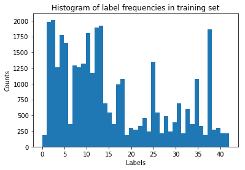

# Traffic Sign Recognition (report by João Sousa-Pinto)

## Objectives

The goal of this project is to train a neural network that is capable of achieving at least 93% accuracy in classifying German traffic signs according to their class; the project encompasses not only the training process itself, but also the other components of this pipeline: downloading the *pickle* files containing the training, validation, and testing datasets; preprocessing the images in these datasets; augmenting the training dataset; performing a high-level analysis of these datasets; testing the performance of the trained model on new images (fetched from the Internet); providing a visualization of what features are being selected by certain layers.

## Dataset summary

The original training set consists of `34799` examples; the validation set consists of `4410` examples; the training set consists of `12630` examples. The shape of each image is `(32,32,3)`, corresponding to `32x32` RGB images. There are `43` different traffic signs appearing in the training dataset.

The frequency histograms of the different traffic signs in each dataset are as follows:

## Approach

### Preprocessing

Our preprocessing pipeline consists of two simple steps:
1) applying [histogram equalization](http://docs.opencv.org/2.4/doc/tutorials/imgproc/histograms/histogram_equalization/histogram_equalization.html) to the images in all datasets, partly solving contrast issues occurring in some images;
2) normalizing the pixel values, by centering them around their mean (measured with respect to the validation set), and by correcting their standard deviation (so that it be equal to `1.0` in the validation set).

Note that it would have been a poor design choice to use, for example, the mean and standard deviation of each specific image to do the normalization, since this would make the inputs of the neural network context-specific (e.g. the same red color could take two very distinct values in separate images).

The reason why this normalization method was chosen (instead of the suggested `normalized(x) = (x-128.0)/128.0` is that the values of the different color channels appeared to be very far from uniformly distributed (often there was a high concentration in fairly small intervals).

Neither of these preprocessing methods seemed to have a huge impact on the validation set accuracy, but they did provide marginal improvements.

We chose to not convert the images to gray-scale during the preprocessing; neural networks are capable of performing simple gray-scale conversion internally (since averaging the color channels is a linear function), if that helps with decreasing the loss.

### Training set augmentation

Augmenting the training dataset is a standard procedure in supervised learning these days. It helps learning a classifier that generalizes well, and prevents over-fitting to the original dataset.

We use a few augmentation strategies:
1) rotations by a random small angle;
2) applying a blur to the input images (deterministic);
3) adding random noise to each color channel;
4) applying random [homographies](http://www.learnopencv.com/homography-examples-using-opencv-python-c/) to the images (more general than rotation/zooming, but the image can get slightly deformed).

The random homographies are selected by selecting a fixed set of four central points in the image, adding a small random noise to them, and forcing the homography to map the initial four points to their noisy versions. The effect of this transformation can be found in the pair of images below.

This essentially corresponds to viewing the world from a different perspective; of course, due to the limited amount of information available in the image, some areas that fall in the picture under the new perspective (but do not under the original one) will be black after the homography is applied.

Applying a perspective transformation is certainly a reasonable preprocessing step, since we can only expect that each traffic light be seen from a slightly different relative position in each occasion.

## Model architecture

### Overview

The starting point for our model was the variant of LeNet described in the lectures. Roughly, the main changes were the removal of the pooling layers and the addition of both one convolution layer and one fully connected layer. We also replaced the ReLU layers with [SELU](https://arxiv.org/abs/1706.02515) layers, which definitely improved the model's performance (as compared to both the standard ReLU layers and also sigmoid/tanh layers).

### Detailed description

My neural network, which I call "LeVandowski net" (since it starts with "Le" and it is fired), consists of:
1) three convolutional layers, with filter depths `8, 8, 2`, strides `1x1, 1x1, 2x2`, and kernels `5x5, 5x5, 5x5`, with `VALID` padding, thereby mapping the initial tensor of shape `(32,32,3)` to tensors of shapes `(28,28,8), (24,24,8), (10,10,2)`, respectively, using SELU activations;
2) a flattening operation, resulting in `10*10*2=200` nodes;
3) three fully connected layers, with output sizes `160, 120, 80` respectively, using SELU activations;
4) a final linear (or affine, if you will) layer, which outputs the `43` logits.
All the layers mentioned above are separated by dropout layers with a shared dropout rate, which we elaborate on below.

## Model training

We trained our model over `40` epochs, each consisting of a newly-generated augmented dataset (note that, as mentioned above, some of our augmentation transformations were randomized); for efficiency purposes, the deterministic transformations were not recomputed at the beginning of each epoch.

We used the `tf.train.AdamOptimizer`, since it seemed to perform at least as well as `tf.train.AdadeltaOptimizer` and `tf.train.AdagradOptimizer`.

We used a scheduler to control both the learning rate and the dropout rate throughout the training process; a schedule consists of a list of `Epoch-LearningRate-KeepProbability` triples, where `KeepProbability` is `1.0-DropoutRate`. We used the following schedule: `[(10, 0.001, 1.0), (10, 0.001, 0.9), (10, 0.0005, 0.8), (10, 0.0005, 0.7)]`.

Using a high dropout in the early stages of training can significantly obstruct progress, so delaying a more aggressive dropout until the later stages of training seemed like the reasonable thing to do.

## Solution approach

We achieved 95.1% accuracy on the validation set and 95.8% accuracy on the training set (both in epoch 26). We only save over previous checkpoints when the validation set accuracy is improved in later epochs, which did not happen in this case. The test accuracy was 92.6% (this value was only computed at the time of writing this report, with no changes being made thereafter).

My approach was not very iterative; instead, I focused on solving each component of the pipeline well, but in a linear fashion. In my view, the key components that allowed me to reach the required accuracy on the validation set (93%), and in fact beat it by 2%, were:
1) the use of SELU activations;
2) the use of homographies in augmenting the training dataset;
3) the way in which ever-more-aggressive dropout was scheduled.

A plot of the confusion matrix for the validation dataset can be found below.

Please refer to the notebook for a precision/recall analysis. It is clear that it is possible to reach very high values of precision and recall simultaneously for each traffic sign, and the challenge of this project lies in providing good precision/recall scores in the signs that are under-represented in the original training set (for quite a few signs, we only have 30 or 60 training examples).

## Testing the model on new images

Here are the five images I downloaded for testing purposes:

Our model classified them as being, respectively, 'Slippery road', 'General caution', 'General caution', 'Road work', and 'Speed limit (30km/h)', corresponding to a 60% accuracy rate. Unsurprisingly, this is lower than the reported test accuracy (92.6%), since these images were acquired and preprocessed differently (although I did apply my preprocessing pipeline on them). Moreover, one of the images (the third, actually contains a pretty visible 'Priority road' traffic sign in the back), which makes it hard to classify. The main visible sign in the picture, 'Yield', scored second.

These images were obtained from Google Image Search, cropped using ImageMagick, and resized to `32x32` using OpenCV's `cv2.INTER_AREA` interpolation algorithm.

The most significant logits for each of these images were as follows:
1) 'Slippery road', 'Dangerous curve to the left', 'Right-of-way at the next intersection', 'No passing', and 'No passing for vehicles over 3.5 metric tons';
2) 'General caution', 'Pedestrians', 'Traffic signals', 'Road narrows on the right', and 'Right-of-way at the next intersection';
3) 'General caution', 'Yield', 'Keep right', 'No entry', and 'Traffic signals' (note that the background sign, 'Priority road', does not appear here, and that the right label appears second);
4) 'Road work', 'Right-of-way at the next intersection', 'Beware of ice/snow', 'Pedestrians', and 'General caution';
5) 'Speed limit (30km/h)', 'Speed limit (20km/h)', 'Speed limit (50km/h)', 'Speed limit (80km/h)', and 'End of speed limit (80km/h)' (note that all of these are completely off).

The corresponding probabilities were, respectively:
1) [ 0.53674084,  0.41021359,  0.02243277,  0.02100401,  0.0096088 ]
2) [ 9.99872804e-01, 8.41284491e-05, 2.00139748e-05, 1.63100704e-05, 6.68842631e-06 ]
3) [ 0.38586387, 0.2144867, 0.21113734, 0.10630795, 0.08220422 ]
4) [ 0.8433997, 0.14994322, 0.00324018, 0.00172584, 0.00169102 ]
5) [ 0.42959258, 0.30500275, 0.10066373, 0.08846615, 0.07627483 ]

## Visualizing the first convolutional layer
You may find the outputs of all the filters present in the first convolutional layer below, when fed a randomly selected image from the training set (in this case, a 'Keep right' sign):

